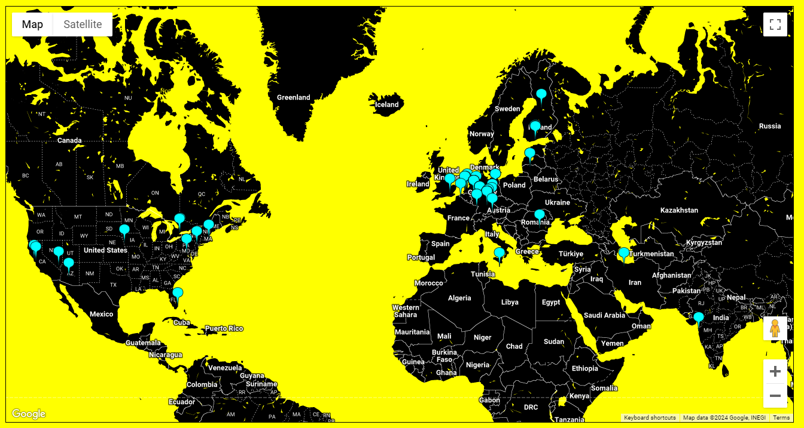

# namada-map

## Description
The namada-map shows the geographical distribution and diversity of the pre-genesis validators within the Namada network. This visualization is crucial as diversity among validators enhances network security, resilience, and decentralization, mitigating risks associated with geographical or jurisdictional concentration. 

For Namada's shielded pool, diversity ensures robust privacy protections by preventing any single entity from dominating the validation process and protecting the network against censorship and collusion.

Incorporating the active validator set can significantly expand Namada-map's utility. This expansion will offer real-time insights into the network's decentralization and security stance.

__Don't forget to use the insane Visual Identity Kit Namada provides.__ https://namada.net/visual-identity

## API Requirements
namada-map requires to integrate with two key APIs:

* __Google Maps Platform__ - Essential for rendering the interactive map. Users must register to obtain an API key. https://developers.google.com/maps
* __IPInfo.io__ - Enables the conversion of IP addresses into geographical coordinates (longitude and latitude), necessitating an Access Token from a registered account. https://ipinfo.io

## Installation 
_NOTE -_ Make sure Ubuntu and Apache are pre-installed. Configuration involves inserting the obtained API key and Access Token into the designated sections within index.html:

* Google Maps API Key: `<TODO::Google-API-KEY>`
* IPInfo Access Token: `<TODO::IPINFO-API-TOKEN>`

Additionally, the __pre-genesis file__ must be uploaded to the same directory as index.html. https://namada.info/shielded-expedition.88f17d1d14/output/genesis_tm_address_to_alias.json

## Limitation
The Google Maps Platform provides a trial period that may limit long-term free access. IPInfo offers a limited monthly lookup under its free plan. 

## Example

    

