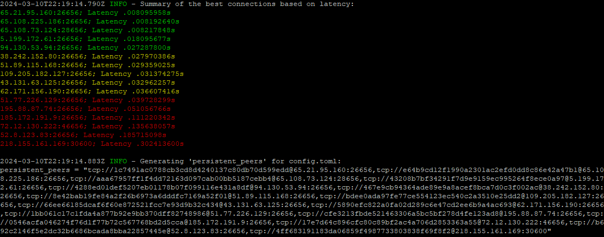

# PersistentPeersProbe.sh

This script automates measuring and sorting network latencies for a list of persistent peers defined in `config.toml`. It is beneficial for resync and optimizing peer connectivity based on latency.

## Features
- **Latency Measurement**: Automatically pings a list of peers to measure network latency.
- **Sorting**: Sorts peers based on their latency, from lowest to highest.
- **Configuration Compatibility**: Format the sorted list for direct insertion in `config.toml`.


## Prerequisites
Ensure you have `nc` (netcat) installed on your system.

## Usage
1. Modify the `configPath` variable within the script to point to the location of `config.toml`.
2. Ensure the script is executable:
   ```bash
   chmod +x PersistentPeersProbe.sh
   ```

## Example
<div style="width: 100%; display: flex; justify-content: center; margin-bottom: 32px;">
    
</div>

